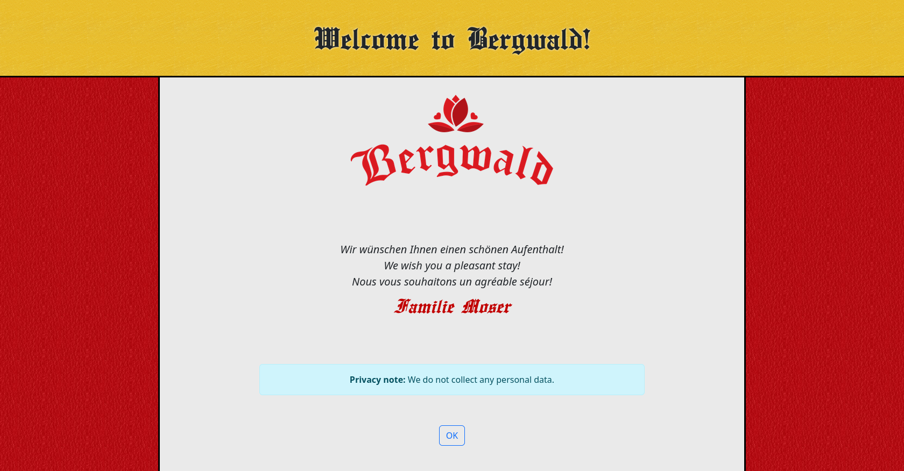

# Captive splash screen

A `bootstrap`-based splash screen for captive portals such as `nocatsplash` or `nodogsplash`.

## Captive portals

When set up on a gateway router, captive portals will prevent users from accessing the internet immediately
after connecting to the network.
After establishing the network connection, users will be required to accept the terms and conditions
of the network provider on a configured splash screen.

## Build

The project can be built with the follwing commands:

1. `npm install`
2. `npm run build`

The finished artifacts are stored in `dist/`.

## Screenshot

